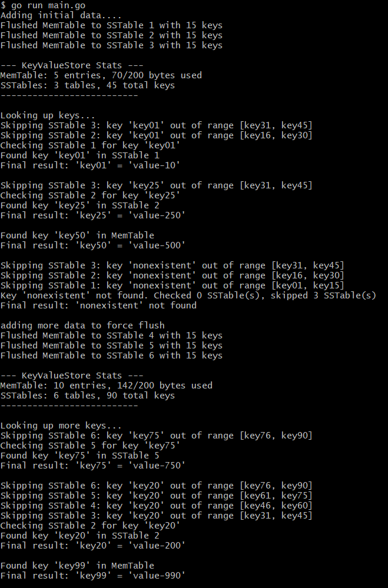

# KV Store with Bloom Filters

This is a toy implementation of a log-structured merge tree (LSM Tree) inspired by modern storage systems. It features Bloom filters for optimized SSTable lookups and demonstrates how data moves from in-memory storage to persistent files on disk.

## 🔧 Features
- In-memory MemTable with size threshold–based flush
- SSTables on disk with metadata: min/max key and Bloom filters
- Logs detailing lookup path and storage operations
- Bloom filter + key range to skip irrelevant SSTables

## Run it 
````````
go run main.go
````````

## Output


<br />
<br />

- <b>Initial Inserts:</b> Keys key01 to key45 are added, and MemTable flushes every 15 inserts to create 3 SSTables.
- <b>MemTable State:</b> Shows 5 entries left in MemTable and 3 SSTables with 45 total keys.
- <i>key01</i> found in SSTable 1 (after skipping 2 irrelevant SSTables).
- <i>key25</i> found in SSTable 2
- <i>key50</i> found directly in MemTable
- <i>nonexistent</i> key correctly skipped all SSTables using range and Bloom filter.
- <b>More Inserts:</b> Keys up to key99 are added, creating 3 more SSTables.
- <i>key75</i> found in SSTable 5
- <i>key20</i> found in SSTable 2 after skipping 4 others
- <i>key99</i> found directly in MemTable
